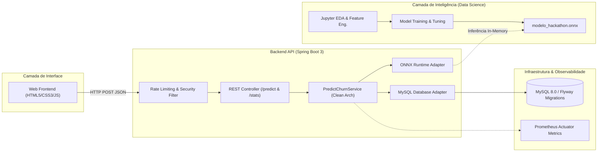

# 🎧 ChurnInsight — Plataforma Preditiva de Churn com IA & Clean Architecture

[](https://openjdk.org/)
[](https://spring.io/projects/spring-boot)
[](https://python.org/)
[](https://onnxruntime.ai/)
[](https://www.docker.com/)
[](https://www.oracle.com/br/education/oracle-next-education/)

> **Monorepo Consolidado**: Este repositório unifica todas as camadas do projeto desenvolvido pela **Equipe DataBeats (Equipe 14)** durante o **Hackathon ONE (Oracle Next Education + NoCountry)**, preservando 100% do histórico original de commits e créditos de todos os autores.

---

## 📌 Visão Geral da Solução

O **ChurnInsight** é uma solução corporativa de inteligência de dados voltada para serviços de streaming musical. Seu objetivo é **prever a probabilidade de cancelamento (churn)** de assinantes com base no comportamento de uso (tempo diário de reprodução, taxa de músicas puladas, frequência de anúncios escutados, tipo de dispositivo e plano).

A plataforma integra pipelines de **Ciência de Dados**, um modelo de Machine Learning exportado para **ONNX** de altíssimo desempenho, e uma **API RESTful escalável em Spring Boot 3** implementada sob os preceitos de **Clean Architecture / Ports & Adapters**.



---

## 📁 Estrutura do Monorepo

```
churninsight/
├── backend/                  # API RESTful em Java 21 / Spring Boot 3
│   ├── src/main/java/        # Clean Architecture (Application, Domain, Infra)
│   ├── src/main/resources/   # db.migration (Flyway), modelo_hackathon.onnx, application.properties
│   ├── Dockerfile            # Imagem Docker otimizada com ZGC e tuning de memória
│   └── pom.xml               # Dependências Spring, ONNX Runtime, Prometheus, etc.
│
├── ml-model/                 # Pipeline de Ciência de Dados & Machine Learning
│   ├── notebooks/            # Análise Exploratória (EDA), tratamento de outliers e testes de modelos
│   ├── data/                 # Datasets de treinamento e validação
│   └── models/               # Pipeline de exportação para Open Neural Network Exchange (ONNX)
│
└── frontend/                 # Interface Web do Usuário
    ├── index.html            # Formulário de simulação de perfil de cliente
    ├── styles/               # Estilização responsiva
    └── scripts/              # Lógica de integração com a API via Fetch
```

---

## 🚀 Destaques Técnicos

### 1. Inferência de Machine Learning de Baixa Latência (ONNX Runtime)
- O modelo treinado pela equipe de Data Science em Python foi convertido para o formato aberto **ONNX** (`modelo_hackathon.onnx`).
- A API Spring Boot executa o modelo diretamente em memória através do **Microsoft ONNX Runtime Java API**, eliminando a necessidade de microserviços intermediários em Python e reduzindo a latência para a faixa de milissegundos.

### 2. Clean Architecture (Hexagonal / Ports & Adapters)
- **Domain**: Entidades puras (`CustomerProfile`, `ChurnPrediction`, regras de negócio).
- **Application**: Portas de entrada (`PredictChurnUseCase`) e serviços de orquestração.
- **Infrastructure**: Adaptadores desacoplados de entrada (Controllers REST) e de saída (Persistência MySQL via Spring Data e Motor de Inferência ONNX).

### 3. Confiabilidade e Observabilidade
- **Rate Limiting Nativo**: Proteção contra abuso com limites de rajada e requisições/segundo.
- **Métricas Personalizadas com Prometheus**: Exposição de latências de inferência (`houseprice.prediction.latency`), volume total de predições e taxas de erro via Spring Boot Actuator.
- **JVM Otimizada**: Configurada no container com **ZGC (Z Garbage Collector)** para tempos de pausa ultrabaixos.

---

## 💻 Como Executar

### Pré-requisitos
- [Docker](https://www.docker.com/) e [Docker Compose](https://docs.docker.com/compose/) instalados
- [Java 21+](https://openjdk.org/) e [Maven](https://maven.apache.org/) (opcional, para execução local sem Docker)

### Executando com Docker Compose

```bash
# 1. Clone ou acesse o monorepo
cd churninsight/backend

# 2. Suba o banco de dados MySQL e a aplicação
docker-compose up -d

# 3. Verifique o status da aplicação
curl http://localhost:10808/actuator/health
```

### Exemplo de Requisição de Predição

```bash
curl -X POST http://localhost:10808/predict \
  -u admin:admin123 \
  -H "Content-Type: application/json" \
  -d '{
    "gender": "Male",
    "age": 29,
    "country": "Brazil",
    "subscriptionType": "Premium",
    "listeningTime": 540.0,
    "songsPlayedPerDay": 12,
    "skipRate": 0.15,
    "adsListenedPerWeek": 0,
    "deviceType": "Mobile",
    "offlineListening": true,
    "userId": "12345"
  }'
```

**Resposta:**
```json
{
  "label": "WILL_CHURN",
  "probability": 0.6087930798530579
}
```

---

## 👥 Equipe DataBeats (Hackathon ONE)

Este projeto foi construído colaborativamente pela equipe:

### Time Back-End ☕
- [**Wendell Dorta**](https://github.com/WendellD3v) — Desenvolvimento de endpoints, arquitetura e Docker
- [**Ezandro Bueno**](https://github.com/ezbueno) — Adapters de infraestrutura e persistência
- [**Jorge Filipi Dias**](https://github.com/jorgefilipi) — Validações e regras de domínio
- [**Wanderson Souza**](https://github.com/wandersondevops) — Configuração de pipeline e observabilidade

### Time Data Science & Machine Learning 📊
- [**André Ribeiro**](https://github.com/aluizr) — Modelagem preditiva e exportação ONNX
- [**Kelly Muehlmann**](https://github.com/kellymuehlmann) — Análise exploratória e feature engineering
- [**Luiz Alves**](https://github.com/lf-all) — Validação estatística e métricas de acurácia
- [**Mariana Fernandes**](https://github.com/mari-martins-fernandes) — Preparação de datasets e balanceamento de classes

---

## 🔗 Referências Originais e Repositório Principal

- **Repositórios da Organização Original do Hackathon**: [Equipe-14-DataBeats-Hackaton-NoCountry (Repositórios)](https://github.com/orgs/Equipe-14-DataBeats-Hackaton-NoCountry/repositories)
- **Repositório Monorepo no GitHub**: [Wendell-Dorta/Hackathon-ONE-G8-E14-ChurnInsight](https://github.com/Wendell-Dorta/Hackathon-ONE-G8-E14-ChurnInsight)
- **Status e Evolução**: Este monorepo mantém o registro fiel das contribuições e histórico de commits originais da equipe DataBeats, servindo como base consolidada para futuras evoluções técnicas, refatorações e adições de features desenvolvidas individualmente por **Wendell Dorta**.
